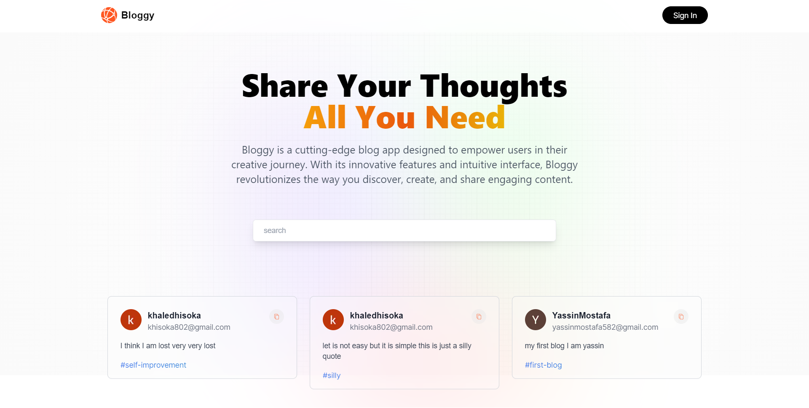
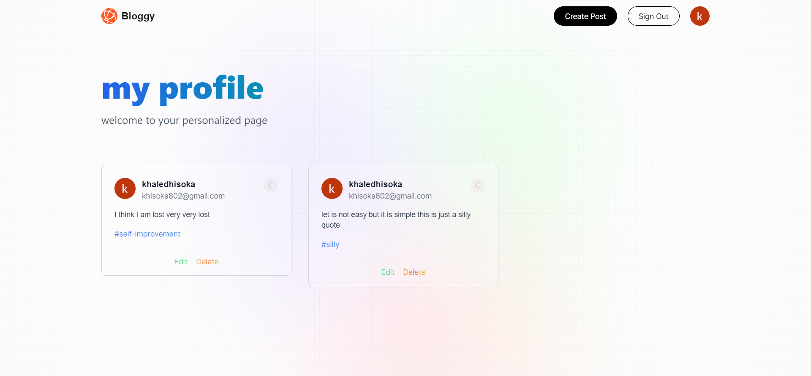
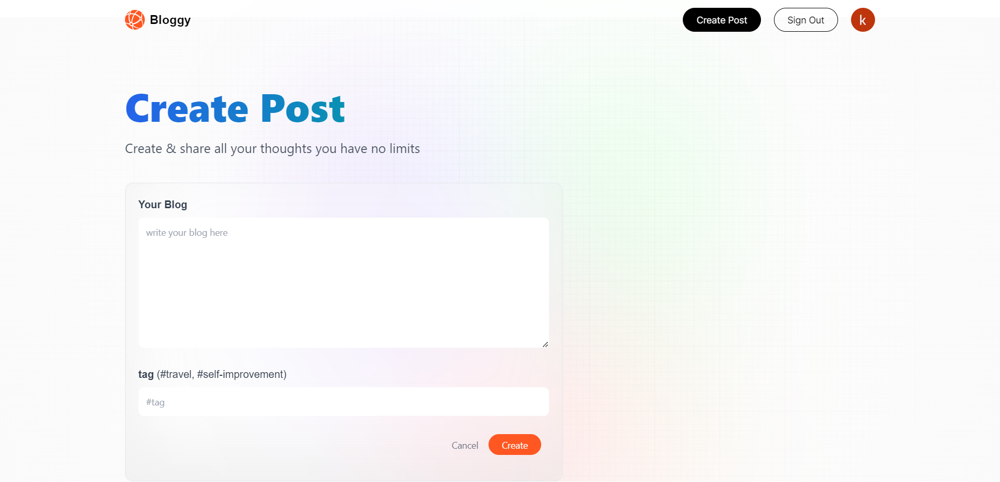
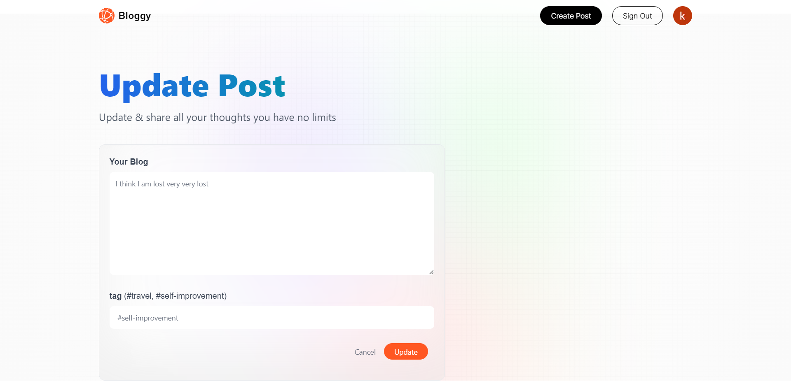
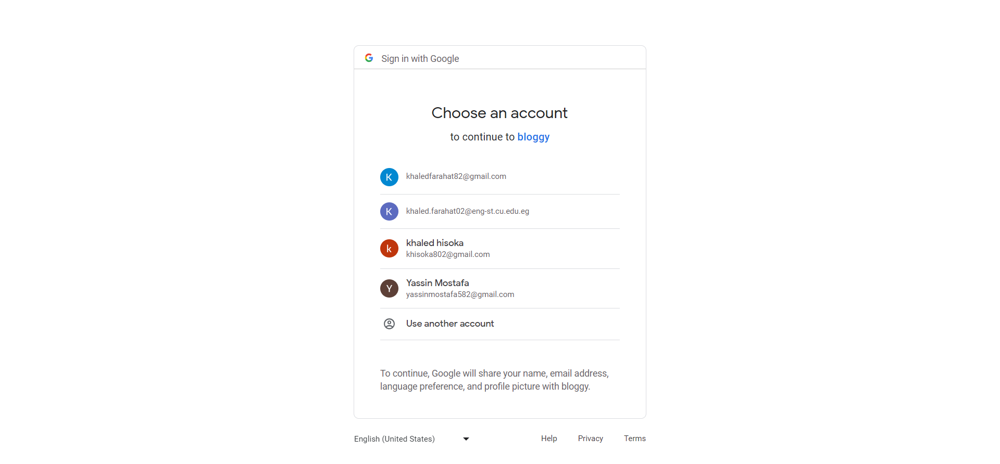

# Bloggy - A Blog App

Bloggy is a blog application that allows users to create, edit, and delete blogs. Each blog consists of content and tags. The application also provides authentication and authorization features, allowing users to log in securely. Additionally, Bloggy offers the option to log in using Google credentials.

## Table of Contents
- [Bloggy - A Blog App](#bloggy---a-blog-app)
  - [Table of Contents](#table-of-contents)
  - [Introduction](#introduction)
  - [Features](#features)
  - [Demo](#demo)
    - [Home Page](#home-page)
    - [Profile Page](#profile-page)
    - [create blog Page](#create-blog-page)
    - [edit blog Page](#edit-blog-page)
    - [Login with google](#login-with-google)
  - [Technologies Used](#technologies-used)
  - [Getting Started](#getting-started)
  - [Installation](#installation)
  - [Configuration](#configuration)
  - [Usage](#usage)
  - [Contributing](#contributing)
  - [License](#license)

## Introduction

Bloggy is a simple and user-friendly blog app that enables users to create and manage their blogs efficiently. The application offers a rich text editor for composing blog content and the ability to add tags for better categorization and organization. Users can create an account with email and password, and for added convenience, they can also log in using their Google accounts.

## Features

- User Authentication: Users can create accounts, log in, and log out securely.
- Google Login: Users have the option to log in using their Google credentials.
- Create Blogs: Users can create new blogs with a title, content, and tags.
- Edit Blogs: Users can edit the content and tags of their existing blogs.
- Delete Blogs: Users have the ability to delete their own blogs when needed.
- Rich Text Editing: The blog content can be formatted using a rich text editor for better presentation.
- Tagging: Users can add tags to their blogs for easy categorization.
- Responsive Design: The application is built with responsiveness in mind for a seamless experience across devices.

## Demo

### Home Page



### Profile Page



### create blog Page



### edit blog Page



### Login with google



## Technologies Used

The Bloggy project utilizes the following technologies:

- [Tailwind CSS](https://tailwindcss.com/): A utility-first CSS framework for rapidly building custom user interfaces.
- [Next.js](https://nextjs.org/): A popular React framework for building server-side rendered (SSR) and using nextjs 13 and latest features app route
- [NextAuth.js](https://next-auth.js.org/): An authentication library for Next.js applications that supports various providers, including Google.

## Getting Started

To set up the Bloggy project locally, follow the instructions below.

## Installation

1. Clone the repository:

```bash
git clone https://github.com/your-username/bloggy.git
cd bloggy
```

2. Install the dependencies:

```bash
npm install
```

## Configuration

Before running the application, you need to configure the authentication provider for NextAuth.js to enable Google login. Refer to the NextAuth.js documentation for details on setting up Google OAuth credentials.

## Usage

1. Run the development server:

```bash
npm run dev
```

2. Open your browser and navigate to [http://localhost:3000](http://localhost:3000) to access the Bloggy application.

3. Create an account or log in using your Google credentials.

4. Start creating, editing, and managing your blogs from the user dashboard.

## Contributing

Contributions to Bloggy are welcome and encouraged! If you find any issues or have suggestions for improvements, please feel free to submit a pull request.

Before making significant changes, it's a good idea to open an issue to discuss the proposed changes.

## License

The Bloggy project is open-source and is licensed under the [MIT License](LICENSE).
